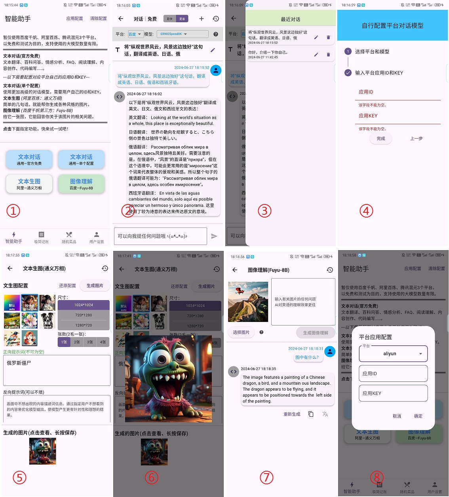
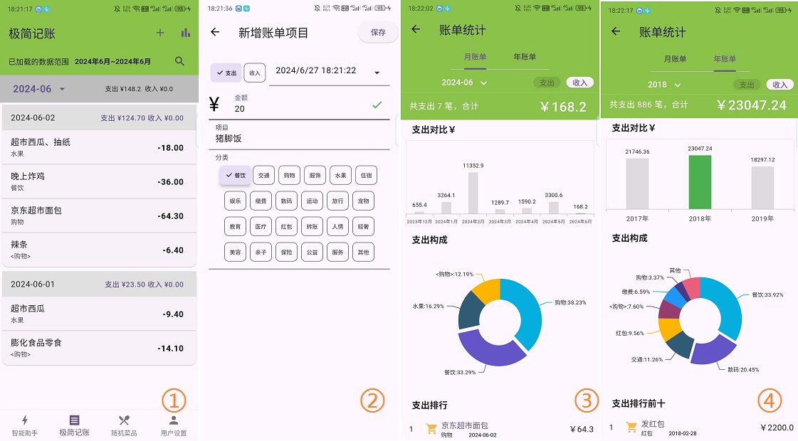

<!-- START doctoc generated TOC please keep comment here to allow auto update -->
<!-- DON'T EDIT THIS SECTION, INSTEAD RE-RUN doctoc TO UPDATE -->
<!-- **Table of Contents**  *generated with [DocToc](https://github.com/thlorenz/doctoc)* -->

- [AI Light Life](#ai-light-life)
  - [项目说明](#项目说明)
    - [版本说明](#版本说明)
    - [创建原因](#创建原因)
  - [功能详述](#功能详述)
    - [Part1: 智能助手 agi\_llm\_sample](#part1-智能助手-agi_llm_sample)
    - [Part2: 极简记账 brief\_accounting](#part2-极简记账-brief_accounting)
    - [Part3: 随机菜品 random\_dish](#part3-随机菜品-random_dish)
      - [使用说明](#使用说明)
      - [导入的菜品 json 文件格式示例](#导入的菜品-json-文件格式示例)
      - [菜品菜谱 json 数据](#菜品菜谱-json-数据)
    - [Part4: 用户配置 user\_and\_settings](#part4-用户配置-user_and_settings)
  - [其他说明](#其他说明)
    - [关键文件缺失](#关键文件缺失)
    - [开发环境](#开发环境)
    - [仅 Android](#仅-android)
    - [TODO](#todo)

<!-- END doctoc generated TOC please keep comment here to allow auto update -->

# AI Light Life

## 项目说明

**一个包含极简的记账、幸运转盘随机菜品，和简单的 AI 对话、文生图、图像理解等功能的 flutter 应用**。

### 版本说明

- 2024-06-27 `v0.1.0-beta.1`

  - 基本完成了极简记账的核心功能；
  - 基本完成了极简 AI 文本对话的核心功能；
    - “文本对话-官方免费”部分整合了百度、腾讯、阿里几个免费使用的大模型 API；
    - “文本对话-单个配置”需要自行配置百度、腾讯、阿里的应用 ID 和 KEY，使用自己的付费 API；
    - “文本生图-通义万相”需要自行配置阿里云百炼平台的应用 ID 和 KEY；
    - “图像理解-Fuyu8B”使用百度千帆平台的 Fuyu-8B 在线服务，需要自行配置百度千帆平台的应用 ID 和 KEY；
  - 添加幸运转盘获取随机菜品的功能；
  - 用户设置页面中可将应用内部数据完全的备份还原。

### 创建原因

- 一开始只是单纯想开发一个极其简单的自用本地记账的 app。
- **但 2024 年 5 月底国内大模型开启价格战，有了一大批免费使用的 API**，就临时继续在该项目上测试一下效果。
- 后来发现经常问答有点帮助，就修改了项目定位，改为生活助手类，并整合了之前写好的随机菜品的功能。
  - 随机菜品功能，可以随机生成一个菜品，并给出菜品的详细介绍。为了解决整天不知道吃什么的问题。
- 后续可能会再添加一些自己需要的小功能，逐步形成一个完整的**可能带有 AI 功能的生活助手应用**。

## 功能详述

### Part1: 智能助手 agi_llm_sample

仅仅简单调用百度、腾讯、阿里平台的部分大模型 API，具体功能还在思考当中。



- 图 1：目前有考虑文本对话、文生图、图生文的试用；
- 图 2：“文本对话-官方免费”部分整合了百度、腾讯、阿里几个免费使用的大模型 API；
  - 3 个平台五六个模型可切换使用；
  - 图 3：右上角“最近”会保留最近的对话记录，存入本地的 sqlite 中；
- 图 4：“文本对话-单个配置”需要自行配置百度、腾讯、阿里的应用 ID 和 KEY(见图 8)，使用自己的付费 API；
  - 就算使用自己付费的模型，模型 API 目前我还没有兼容几个；
- 图 5：“文本生图-通义万相”使用阿里云的通用万相绘制图片，也会留存最近的文生图记录；
  - 文本生图需要自行配置阿里云百炼平台的应用 ID 和 KEY；
  - 图 6：可以点击进行预览，长按进行保存；
  - 生成的图片默认放在阿里云的 OSS，过期时间为 1 天；
- 图 7：“图像理解-Fuyu8B”可以对传入的图片进行理解，并回复相关问题，英文更佳；
  - 使用百度千帆平台的 Fuyu-8B 在线服务，需要自行配置百度千帆平台的应用 ID 和 KEY；
- 图 8：在“智能助手”首页右上角可以一次性配置某个平台的应用 ID 和 KEY，需要相关平台的功能才能使用。

### Part2: 极简记账 brief_accounting

极度简单的支出流水账记录，虽然名字是记账，但实际上就是一些流水账，然后简单的统计图表。



- 图 1：每天的支出收入信息。
  - 默认是显示当前月份的数据，**上下滚动会切换月份**。
  - 右上角“搜索”按钮，可以对所有的记录进行**关键字搜索**，可以看到相关关键字条目的记录，但不会进行相关统计。
  - **_长按_** 主页的收支记录项次，可以对其进行**删除**。
  - **_双击_** 主页的收支记录项次，可以对其进行**修改**。
- 图 2：点击右上角“加号”按钮，可以**添加**一条新的支出记录。
- 图 3 和图 4：点击右上角“条状图”按钮，可以进入统计图表页面。
  - 目前仅支持简单的按月和按年的柱状图和分类饼图显示。
  - 点击月份和年份下拉按钮，可以切换月份和年份。

### Part3: 随机菜品 random_dish

_这个其实是之前(2024-04-09)就单独开发好的 app 了，功能融合，就直接复制到这里来。_

给不知道每天吃什么的选择困难症患者，指一条参考选项：随机选择一道菜。

如果你关于吃什么，已经习惯了：**随便、不知道、好麻烦、你做主、看运气** 等说法，不妨试一试。

当然，最后是点外卖还是自己做甚至选了依旧不吃，还是看自己的决定。

#### 使用说明

如下图：

- 主体是一个转盘，可以选择餐次和重新生成随机菜品。
- 点击转盘即可开始旋转，3 秒后停止，显示结果，旋转时按钮都不可点击。
- 点击选中结果可以跳转到该菜品详情页。
- 如果菜品详情有视频地址，可以打开对应 url；如果菜谱有上传图片(仅支持单张本地图片和使用相机拍照)，可以缩放查看。


- 当然核心还是菜品的数量，默认是文字列表显示，仅仅为了节约流量。
- 点击上方“grid”图标(第一个)可以切换到有预览图的卡片列表，如果图片大注意流量消耗。
- 在列表中点击某一个可以进入详情页(如上)，长按可以删除指定菜品。
- 点击上方“upload”图标(第二个)可以导入菜品 json 文件(格式见下面相关内容，其中图片时本地图片的地址则暂未考虑)。
- 当然，也可以自行一个个手动添加菜品。


#### 导入的菜品 json 文件格式示例

```json
[
  {
    "dish_name": "回锅肉",
    "description": "此菜色味俱佳，肉鲜而香，是四川省家喻户晓的传统菜，地方风味很强。",
    "tags": "川菜,家常菜,肉菜,麻辣鲜香",
    "meal_categories": "午餐,晚餐,夜宵",
    "images": [
      "http://www.djy.gov.cn/dyjgb_rmzfwz/uploads/20191014154045sde1q1ajz3d.jpg",
      "https://i3.meishichina.com/atta/recipe/2019/04/18/20190418155556766674398811368081.jpg?x-oss-process=style/p800"
    ],
    "videos": ["https://www.bilibili.com/video/BV1eA4m1L7QY/"],
    "recipe": [
      "原料：\n猪肉500克，蒜苗150克，化猪油40克，盐1克，郫县豆瓣50克，甜酱25克，红白酱油25克，生姜15克，葱20克，花椒10余粒。",
      "作法：\n1. 把带皮的肥瘦相连的猪肉洗干净。",
      "2. 锅内放开水置旺火上，下猪肉和葱、姜、花椒；将熟肉煮熟不煮𤆵；在煮肉过程中撇去汤面浮沫。蒜苗洗净切2.6厘米(约八分)长节。豆瓣剁细。",
      "3. 将捞起的猪肉敞干水汽，在还有余热时切成约0.3厘米(约一分)厚的连皮肉片。",
      "4. 炒锅置中火上，放入猪肉，油烧至五成热时下肉片，同事放微量盐炒均匀；炒至肉片出油时铲在锅边，相继放豆瓣、甜酱在油中炒出香味即与肉共同炒匀，然后放蒜苗合炒；蒜苗炒熟但不要炒蔫，再放酱油炒匀起锅即成。",
      "附 注：\n1.在肉汤中加适量新鲜蔬菜同煮，可增加一样汤菜。",
      "2.根据爱好，菜内可加豆豉炒。",
      "3.如无红酱油可用白糖代替。"
    ],
    "recipe_picture": "https://demo.image.com" // 菜谱只支持单张图片
  },
  { …… }
]
```

后续我也会分享一下自用的菜品列表 json 文件，可以一起试用完善。

#### 菜品菜谱 json 数据

- 2024-07-11

已将 github 中 [Anduin2017/HowToCook](https://github.com/Anduin2017/HowToCook) 仓库中的菜品整理为可导入的 json 数据。参看`_dishes`文件夹：[HowToCook 菜谱 json 数据](_dishes/HowToCook/HowToCook-All合并-持续更新-20240711.json) 文件，其中菜品的图片大部分来源于 [下厨房](https://www.xiachufang.com/) 网站。

### Part4: 用户配置 user_and_settings

目前其实没有用户这个概念，除了调用 API 和一些网络图片，都没有需要联网的东西。

这个模块目前仅有一个"备份恢复"功能。

因为智能助手的对话记录、极简记账的账单条目、随机菜品的菜品列表，都是本地 sqlite 存储的，所以备份就是把 db 中的数据导出成压缩包，恢复就是把压缩包的 json 存入数据库中。

哦，那个更换头像纯粹自娱自乐。

## 其他说明

### 关键文件缺失

注意，项目中应该有一个`lib/apis/_self_keys.dart`文件，如果要自己运行项目的话注意补上。

内容如下，为 BAT 平台的应用 ID 和 KEY：

```dart
// ignore_for_file: constant_identifier_names
/// 百度的相关
const BAIDU_API_KEY = "xxx";
const BAIDU_SECRET_KEY = "xxx";
/// 腾讯的相关
const TENCENT_SECRET_ID = "xxx";
const TENCENT_SECRET_KEY = "xxx";
/// 阿里云的相关
const ALIYUN_API_KEY = "xxx";
const ALIYUN_APP_ID = "xxx";

// SiliconFlow的密钥
const siliconCloudAk = 'sk-xxx';
```

### 开发环境

在一个 Windows7 中使用 Visual Box 7 安装的 Ubuntu20.04 LTS 虚拟机中使用 VSCode 进行开发。

2024-05-27 使用最新 flutter 版本：

```sh
$ flutter --version
Flutter 3.22.1 • channel stable • https://github.com/flutter/flutter.git
Framework • revision a14f74ff3a (4 天前) • 2024-05-22 11:08:21 -0500
Engine • revision 55eae6864b
Tools • Dart 3.4.1 • DevTools 2.34.3
```

### 仅 Android

**手里没有 IOS 等其他设备，所以相关内容为 0**。

虽然我日常主力机为努比亚 Z60 Ultra(Android 14)，但它和我之前的 Z50 Ultra 一样，[**无法实机开发调试**](https://github.com/flutter/flutter/issues/144999)，所以只有最后打包成 app 后进行使用测试。

而第二主力机是小米 6(Android 9)，是 16:9 的 1080P 完整屏幕，和目前主流手记的分辨率和长 K 宽比都不一样，几乎肯定在其他的设备有一些显示上的差距，可以反馈或自行修改。

根据模型设计的思想，可以看随手记的 [开发记录](_md_pics/development_records.md) 文档。

### TODO

- 因为自用，事前没有完整的项目规划，所以代码质量比较差。
  - 许多同样逻辑的代码但写得五花八门，很多没用的组件代码块还保留，注释的代码还保留，甚至 print 都还保留。
- 智能对话
  - 通义千问-VL 调用 API 未符合预期
- 一开始就只是想试一下百度的两个免费的模型 API，没有对平台和模型进行兼容性设计。
  - 目前提供免费 token 的大模型和云平台有很多，这一块会继续完善。
- 其实目前大模型 token 都很便宜，但是具体能用来做什么，真的不知道。
