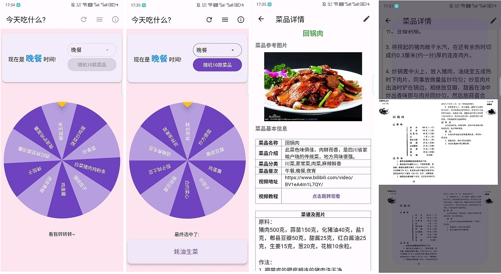
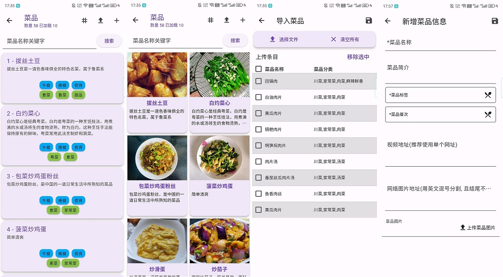

# AI Light Life

- [AI Light Life](#ai-light-life)
  - [说明](#说明)
  - [项目版本](#项目版本)
  - [项目依赖](#项目依赖)
  - [Part1: 记账部分 brief\_accounting](#part1-记账部分-brief_accounting)
    - [核心想法](#核心想法)
    - [页面设计](#页面设计)
  - [Part2: AI 大模型部分 agi\_llm\_sample](#part2-ai-大模型部分-agi_llm_sample)
    - [核心想法](#核心想法-1)
    - [页面设计](#页面设计-1)
    - [2024-07-16 实用工具性想法](#2024-07-16-实用工具性想法)
      - [一 核心：目前已有的免费文生文 API 和付费的图生文 API](#一-核心目前已有的免费文生文-api-和付费的图生文-api)
        - [1 你问我答 - 保留免费文本对话，聊天问答机器人 - 免费文生文](#1-你问我答---保留免费文本对话聊天问答机器人---免费文生文)
        - [2 拍照翻译 - 图像识别，但不能重建图片 - 图生文](#2-拍照翻译---图像识别但不能重建图片---图生文)
        - [TODO 3 翻译器 - 文本对话，或者 txt 文本上传下载 - 长文本对话](#todo-3-翻译器---文本对话或者-txt-文本上传下载---长文本对话)
        - [TODO 4 省流侠 - 总结长文本的主要内容，可能编写 PPT 大纲 - 长文本对话](#todo-4-省流侠---总结长文本的主要内容可能编写-ppt-大纲---长文本对话)
        - [TODO 5 时事新闻 - 聚合搜索，关键词 - RAG 检索增强生成](#todo-5-时事新闻---聚合搜索关键词---rag-检索增强生成)
      - [二 扩展：文生图、文生视频、语音合成、语音识别等高级高费用接口](#二-扩展文生图文生视频语音合成语音识别等高级高费用接口)
  - [Part3: 随机菜品 random\_dish](#part3-随机菜品-random_dish)
    - [使用说明](#使用说明)
    - [设计简述](#设计简述)
    - [导入的菜品 json 文件格式示例](#导入的菜品-json-文件格式示例)
  - [开发过程](#开发过程)
    - [开发记录](#开发记录)
    - [TODO](#todo)

## 说明

一些我自己可能常常用的到的小功能，比如记账、菜谱、AI chat 等等

一开始单纯想做个适合自己的非常简陋的记账 app，2024-05-30 添加了一个基于免费的大模型 AI 对话，应用名就不好说了:

- 2024-05-30: Cost and AI Chat (AI 聊天和极简记账(智能对话和记账))
- 2024-06-14: Light Life (简单生活?)
- 2024-06-17: AI Light Life (智能轻生活?)

## 项目版本

- `0.1.x`
  - 基本完成了极简记账的核心功能；
- `0.2.x`
  - 基本完成了极简 AI 对话的核心功能；
- `0.3.x`
  - AI 对话部分整合了百度、腾讯、阿里几个免费使用的大模型 API，可简单切换；
  - 基本可简单使用阿里的通义万相来文本生成图片；
  - 基本可简单使用阿里云平台的 Fuyu-8B 模型来完成图像理解功能；
- `0.4.x`
  - 添加幸运转盘获取随机菜品的功能；
  - `0.4.1`
    - 添加了可自行配置三个平台的部分付费模型(使用用户自己的 appId 和 appKey)
  - `0.4.2`
    - 阿里云的视觉模型测试试用(没实现，http 调用和 API 文档一样都无法使用)

## 项目依赖

2024-05-27 使用最新 flutter 版本：

```sh
$ flutter --version
Flutter 3.22.1 • channel stable • https://github.com/flutter/flutter.git
Framework • revision a14f74ff3a (4 天前) • 2024-05-22 11:08:21 -0500
Engine • revision 55eae6864b
Tools • Dart 3.4.1 • DevTools 2.34.3
```

依赖工具库:

注意，我个人是想着尽可能多的学习使用 flutter 的各项库，所以可能这些依赖并不一定是核心功能必要的。

截止 2024-06-27,使用当前可用的最新版本。

```yaml
dependencies:
  flutter:
    sdk: flutter

  # The following adds the Cupertino Icons font to your application.
  # Use with the CupertinoIcons class for iOS style icons.
  cupertino_icons: ^1.0.2
  sqflite: ^2.3.3+1 # sqlite数据库工具库
  path_provider: ^2.1.3 # 获取主机平台文件系统上的常用位置
  path: ^1.9.0 # 基于字符串的路径操作库
  flutter_easyloading: ^3.0.5 #  loading/toast 小部件
  flutter_screenutil: ^5.9.3 # 适配屏幕和字体大小的插件
  intl: ^0.19.0 # 国际化/本地化处理库
  flutter_localizations:
    sdk: flutter
  # collection: ^1.19.0 #1.19和flutter_test有冲突
  collection: ^1.18.0 # 集合相关的适用工具库
  bottom_picker: ^2.8.0 # 简洁，但不支持仅年月
  month_picker_dialog: ^4.0.0 # 支持仅年月，但是是弹窗，和原始组件类似
  syncfusion_flutter_charts: ^26.1.39 # 图表库
  flutter_form_builder: ^9.3.0 # 表单组件
  form_builder_validators: ^10.0.1 # 表单验证
  form_builder_file_picker: ^4.1.0 # 表单中选择文件
  uuid: ^4.4.0 # uuid
  flutter_markdown: ^0.7.2+1 # 使用md格式显示大模型的响应
  dio: ^5.4.3+1 # http client # http client
  connectivity_plus: ^6.0.3 # 用于发现可以使用的网络连接类型
  pretty_dio_logger: ^1.3.1 # Dio 拦截器，它以漂亮、易于阅读的格式记录网络调用。
  crypto: ^3.0.3 # Dart 的一组加密哈希函数。
  # file_picker: ^8.0.3 # 备份恢复是选择文件路径(v8版本和上面表单中选择文件的库有冲突)
  file_picker: ^5.5.0
  permission_handler: ^11.3.1 # 获取设备各项权限
  archive: ^3.6.1 # 解压缩文件
  device_info_plus: ^10.1.0 # 获取设备信息
  # animated_text_kit: ^4.2.2 # 动画文本特效工具，上次更新2022-06-05 但用户多
  toggle_switch: ^2.3.0 # 第三方的切换按钮
  cached_network_image: ^3.3.1 # 缓存网络图片
  image_gallery_saver: ^2.0.3 # 保存图片到图库(安卓9及以下无效)
  photo_view: ^0.15.0 # 图片预览
  url_launcher: ^6.3.0 # 打开url
  carousel_slider: ^4.2.1 # 轮播滑块小部件
  multi_select_flutter: ^4.1.3 # 一个用于以多种方式创建多选小部件的包
  image_picker: ^1.1.2 # 从设备选图片或者拍照
  flutter_fortune_wheel: ^1.3.1 # 幸运大转盘
  get_storage: ^2.1.1 # 简单键值对本地存储
```

<!-- 下面是开发或整合到本应用的时间顺序，不算分类 -->

## Part1: 记账部分 brief_accounting

极度简单的支出流水账记录……

虽然名字是记账，但实际上就是一些流水账(laundry list)

### 核心想法

记账，“账”虽然是重点，但也不应该忽视“记”这个动作，如果全都自动化了，岂不是"强化数字消费中的失去感"。

还是觉得手动记账，一笔一笔在输入时才能体会的金钱的份量、和记账的意义。

理论上：

- 消费和收入的分类应该有非常专业详细的数据，在后续的报表时肯定用得上。
- 多账本、预算、循环记账等等比较专业的东西，不会，所以没有。
- 什么其他账单的关联(微信、支付宝什么的)，就天方夜谭了。

所以，流水账，非常简单，sqlite 的 DDL：

```sql
CREATE TABLE "income_list" (
	"income_id" INTEGER NOT NULL,
	"date"	    TEXT,
	"category"	TEXT,
	"item"	    TEXT,
	"value"	    REAL,
	PRIMARY KEY("income_id" AUTOINCREMENT)
);

CREATE TABLE "expend_list" (
	"expend_id" INTEGER,
	"date"	    TEXT,
	"category"	TEXT,
	"item"	    TEXT,
	"value"	    REAL,
	PRIMARY KEY("expend_id" AUTOINCREMENT)
);
```

=> 再简单一点，只有一个表，用 `type` 表示收入和支出；  
再加一个 `gmt_modified` ，排序时联合 `date` 栏位共同排序避免和实际新增记录时不一致:

```sql
CREATE TABLE "bill_item_list" (
	"bill_item_id"  TEXT, 		-- 账单条目编号(万一多账本有bill_id呢)
	"item_type"     INTEGER,	-- 0 收入；1 支出
	"date"          TEXT,		-- yyyy-MM-dd 年月日即可
	"category"      TEXT,		-- 支出或收入的大分类(比如支出的：通勤、医疗、饮食……)
	"item"          TEXT,		-- 支出或收入的细项目(比如饮食的晚餐吃快餐) 还可以有细节就再多个detail表
	"value"         REAL,		-- 支出或收入的具体数值
	"gmt_modified"  TEXT,		-- 记录的创建或者修改时间
	PRIMARY KEY("bill_item_id")
);
```

目前设想的功能：

- 流水账(支出列表显示)的显示和记录(全手动输入的简单表单)
- 收入/支出 item 的关键字查询
- 报表仅仅按月、按年显示相关数据
  - (核心目的就是单纯想之前 python 编写的脚本绘制的柱状图在 app 显示罢了)

### 页面设计

就 3 个页面

- 主页面：列表显示每条支出/收入的数据
  - (测试数据的工资收入默认就每月 1 号到账了)
- 新增页面：非常简单的一个表单填写数据
- 报表页面：几个预设的简单图表
- 导入/导出：因为是 app 内置的 sqlite 中，所以导出备份比较重要
  - 方便导入导出，都 json 格式好了，不要什么 excel、pdf 之类的了，不好处理。

## Part2: AI 大模型部分 agi_llm_sample

### 核心想法

其实就是一些免费使用的国内大模型 API 的简单调用，查看效果而已。

用户和 AI 进行对话后，为了能查询历史记录，就把对话内容存入 sqlite，基本表结构：

```sql
-- 2024-06-01 新增AI对话留存
--   图像理解也有对话，所以新加一个对话类型栏位：aigc、image2text、text2image……
--   i2t_image_path 指图像理解时被参考的图片地址(应该是应用缓存的图片地址)
CREATE TABLE "chat_history" (
  uuid                TEXT    NOT NULL,
  title               TEXT    NOT NULL,
  gmt_create          TEXT    NOT NULL,
  messages            TEXT    NOT NULL,
  llm_name            TEXT    NOT NULL,
  yun_platform_name   TEXT,
  i2t_image_path      TEXT,
  chat_type           TEXT    NOT NULL,
  PRIMARY KEY("uuid")
);

-- 2024-06-13 新增文生图简单内容流程
CREATE TABLE "text2image_history" (
  request_id      TEXT    NOT NULL,
  prompt          TEXT    NOT NULL,
  negative_prompt TEXT,
  style           TEXT    NOT NULL,
  image_urls      TEXT,
  gmt_create      TEXT    NOT NULL,
  PRIMARY KEY("request_id")
);
```

### 页面设计

就两层：外层提供文生文、文生图、图生文的选项，内层显示对应的对话列表即可。

### 2024-07-16 实用工具性想法

一些变动：

- 原本“智能助手”模块文件夹从`agi_llm_sample` 改为`ai_assistant`(或许`ai_utilities`更符合？), 其中：
  - `lib\views\ai_assistant\experimental` : 原本小字使用免费、付费、限量的 API 的测试，现在放到
  - `lib\views\ai_assistant\elderly_mode` : 给长辈适配的只有大字版本使用免费文本对话 API 的页面
  - **`lib\views\ai_assistant\ai_tools`: 下方规划中的，全新的具体 AI 工具**
  - \*\*`lib\views\ai_assistant\_components`: 各个大分类模块下的共用组件
    - (整个项目都共用的放到最外面的`lib\common`)

**文件夹命名用全小写下划线可复数，但 index 页面就不带复数，但加 Index 后缀**

目前真不知道这工具到底能做啥：https://www.infoq.cn/minibook/YRh7eroQ34b8d49Oy1si

此部分改变，只为了真正方便用户使用，甚至非专业相关人员、其他普通用户也可以用，少些专业术语和限制。

尽量免费 API，付费的看情况便宜的，虽然不会有人用了。

#### 一 核心：目前已有的免费文生文 API 和付费的图生文 API

##### 1 你问我答 - 保留免费文本对话，聊天问答机器人 - 免费文生文

##### 2 拍照翻译 - 图像识别，但不能重建图片 - 图生文

- 2024-07-18 基本完成基础功能。

##### TODO 3 翻译器 - 文本对话，或者 txt 文本上传下载 - 长文本对话

##### TODO 4 省流侠 - 总结长文本的主要内容，可能编写 PPT 大纲 - 长文本对话

##### TODO 5 时事新闻 - 聚合搜索，关键词 - RAG 检索增强生成

#### 二 扩展：文生图、文生视频、语音合成、语音识别等高级高费用接口

## Part3: 随机菜品 random_dish

_这个其实是之前(2024-04-09)就单独开发好的 app 了，功能融合，就直接复制到这里来。_

给不知道每天吃什么的选择困难症患者，指一条参考选项：随机选择一道菜。

如果你关于吃什么，已经习惯了：**随便、不知道、好麻烦、你做主、看运气** 等说法，不妨试一试。

当然，最后是点外卖还是自己做甚至选了依旧不吃，还是看自己的决定。

### 使用说明

如下图：

- 主体是一个转盘，可以选择餐次和重新生成随机菜品。
- 点击转盘即可开始旋转，3 秒后停止，显示结果，旋转时按钮都不可点击。
- 点击选中结果可以跳转到该菜品详情页。
- 如果菜品详情有视频地址，可以打开对应 url；如果菜谱有上传图片(仅支持单张本地图片和使用相机拍照)，可以缩放查看。



- 当然核心还是菜品的数量，默认是文字列表显示，仅仅为了节约流量。
- 点击上方“grid”图标(第一个)可以切换到有预览图的卡片列表，如果图片大注意流量消耗。
- 在列表中点击某一个可以进入详情页(如上)，长按可以删除指定菜品。
- 点击上方“upload”图标(第二个)可以导入菜品 json 文件(格式见下面相关内容，其中图片时本地图片的地址则暂未考虑)。
- 当然，也可以自行一个个手动添加菜品。



### 设计简述

1. 主体只有简单的一张菜品表:
   ```sql
   CREATE TABLE "dish" (
     dish_id           TEXT      NOT NULL PRIMARY KEY,
     dish_name         TEXT      NOT NULL,
     description       TEXT,
     photos            TEXT,
     videos            TEXT,
     tags              TEXT,
     meal_categories   TEXT,
     recipe            TEXT,
     recipe_picture    TEXT,
     UNIQUE(dish_name,tags)
   );
   ```
2. 把一天分成几个时间段，打开 app 时，显示该时间段的随机 10 个菜品
   1. 如果不满意，可以切换时间段和重新随机 10 个菜品
3. 点击转盘开始旋转，3 秒后选中某个菜品。
   1. 点击该菜品，进入菜品详情，查看图片和菜谱等信息。
4. 可以自行维护菜品列表，导入规范的 json 文件，或者自行添加菜品。
   1. json 文件格式参看下面，注意**导入的 tags 和 meal_categories 不在预设中，有修改后则不会显示**
   2. 具体 tags，比如凉菜、汤菜、煎、炒、烹、炸、焖、溜、熬、炖、汆等
   3. 具体 meal_categories，比如 早餐、晚餐、午餐、夜宵、甜点、主食等
5. TODO(不一定会做)：
   1. 为了随机的乐观性，可以多一张 random_record 随机记录表。
   2. 某个时间段随机过了，就不允许再随机了。
   3. 可以查看随机过的菜品记录。
   4. ……
   ```txt random_record
   random_record_id
   date
   meal_category
   dish_id
   ……
   ```

### 导入的菜品 json 文件格式示例

```json
[
  {
    "dish_name": "回锅肉",
    "description": "此菜色味俱佳，肉鲜而香，是四川省家喻户晓的传统菜，地方风味很强。",
    "tags": "川菜,家常菜,肉菜,麻辣鲜香",
    "meal_categories": "午餐,晚餐,夜宵",
    "images": [
      "http://www.djy.gov.cn/dyjgb_rmzfwz/uploads/20191014154045sde1q1ajz3d.jpg",
      "https://i3.meishichina.com/atta/recipe/2019/04/18/20190418155556766674398811368081.jpg?x-oss-process=style/p800"
    ],
    "videos": ["https://www.bilibili.com/video/BV1eA4m1L7QY/"],
    "recipe": [
      "原料：\n猪肉500克，蒜苗150克，化猪油40克，盐1克，郫县豆瓣50克，甜酱25克，红白酱油25克，生姜15克，葱20克，花椒10余粒。",
      "作法：\n1. 把带皮的肥瘦相连的猪肉洗干净。",
      "2. 锅内放开水置旺火上，下猪肉和葱、姜、花椒；将熟肉煮熟不煮𤆵；在煮肉过程中撇去汤面浮沫。蒜苗洗净切2.6厘米(约八分)长节。豆瓣剁细。",
      "3. 将捞起的猪肉敞干水汽，在还有余热时切成约0.3厘米(约一分)厚的连皮肉片。",
      "4. 炒锅置中火上，放入猪肉，油烧至五成热时下肉片，同事放微量盐炒均匀；炒至肉片出油时铲在锅边，相继放豆瓣、甜酱在油中炒出香味即与肉共同炒匀，然后放蒜苗合炒；蒜苗炒熟但不要炒蔫，再放酱油炒匀起锅即成。",
      "附 注：\n1.在肉汤中加适量新鲜蔬菜同煮，可增加一样汤菜。",
      "2.根据爱好，菜内可加豆豉炒。",
      "3.如无红酱油可用白糖代替。"
    ],
    "recipe_picture": "https://demo.image.com" // 菜谱只支持单张图片
  },
  { …… }
]
```

## 开发过程

### 开发记录

直接在 widget 上用的函数就不加下划线了，如果在其他函数中用的，就加下划线前缀。

- 2024-05-24
  - 基本完成账单列表首页的基础功能和组件占位.
- 2024-05-26
  - 基本完成月度年度统计基础柱状图展示和相关组件的占位
- 2024-04-27
  - feat: 完成账单条目的新增和修改功能; chore: 升级 flutter 为 3.22.1, 相关依赖库为当前最新.
- 2024-05-28
  - 账单条目关键字查询时切换到新的列表展示; feat: 完成带月统计值的列表展示在有多个月数据时滚动到某个月就加载某个月的总计.
  - perf: 优化了图表页面的相关方法，重复度高的代码抽成了公共组件或方法。
  - perf: 优化了账单项目列表主页面、编辑项次表单页面的相关方法和细节。
- 2024-05-29
  - 修正了一些细节；将新增账单项次放到账单列表页面中，调整账单项次表单页面；添加分类选择底部弹窗组件(暂未用到)。
  - 重新调整了账单管理模块的结构，新增 AGI LLM 模块用于对话的组件框架。
- 2024-05-30
  - feat: 调价了基于 dio 的通用 http client 工具类；构建了 Ernie 和 huanyuan 模型的 model 以及基础查询函数。
- 2024-05-31
  - feat: 基本可以正常使用大模型进行对话了。
  - fix: 优化了 AI 对话框的显示细节，完善了一些其他功能细节。
- 2024-06-03
  - feat: 添加了保存 AI 对话记录到本地数据库，可重新读取并继续提问。
- 2024-06-04
  - feat：添加了内部 sqlite 数据的备份恢复功能。
  - feat: 账单统计部分添加了分类统计甜甜圈图。
  - fix: 修正高版本的 Android 请求内部存储的授权问题。
- 2024-06-05
  - fix: 再度修正备份时内部存储管理权限的授权问题，Android14 已正常。
  - feat: 最后一个大模型回复不满意可以点击重新生成；在 appbar 添加“新建对话”按钮；调整标题固定显示在对话正文顶部，点击修改图标可修改。
- 2024-06-06
  - refactor: 添加了阿里云、腾讯、百度通用的基础 aigc 的 http 请求和响应对应的 model; feat: 阿里云通义千问开源版本一个模型接口测试可用。
- 2024-06-07
  - refactor: 重构了通用 aigc 请求 api 和 model 的使用，整理了对应文件命名和文件夹结构等。
  - fix: 简单调整了 llm 名称变量命令、对话主页面的入口按钮样式等。
- 2024-06-11
  - feat: 添加了 AI 对话的流式请求响应的处理; fix:api 还是拆回 3 个平台各自一个文件。
  - fix: 将云平台切换、大模型切换、文生文的流式请求、最近对话统一放在了 AI 对话页面中。
- 2024-06-12
  - fix: AI 对话页面删除历史对话为当前对话时，返回初始对话状态；点击历史对话会替换当前对话而不是新开页面；其他显示细节。
  - feat: 基本完成了阿里的通义万相-文本生成图像的基础使用页面。
- 2024-06-13
  - fix: 调整了通义万相-文本生图页面的细节，修正了循环检查任务状态的逻辑。
  - feat: 新加通义万相-文本生图的简单历史记录留存，简单数据保持到本地数据库。
- 2024-06-14
  - feat: 基本完成了百度云中 Fuyu-8B 图像理解的基础使用页面。
    - 【2024-06-21 更换了选择图片的库】**bug**:每次选择了图片用于上传做理解后，都会在本地生成一个副本图片，传一次就多一张，原因还没看。
  - feat: 添加了 Fuyu-8B 图像理解对话记录存到本地数据库。
  - fix: 简单调整了文本对话、文生图、图生文各自主页面的一些细节，删除部分无意义代码。
- 2024-06-15
  - feat: 添加了 AI 对话限时限量测试版本的基础页面。
    - 【done】todo: 切换模型应该新建对话，因为上下文丢失了。
  - feat: 添加了阿里云中限时限量的对话模型可选列表。
- 2024-06-17
  - feat: 合并了之前的 flutter_random_dish 项目的功能。
    - todo: 数据库文件还是分开的，要何在一起吗？
  - doc: 更新 readme 文件。
  - rename: 重命名了整个项目名称。
- 2024-06-20
  - feat: 添加了支持阿里、百度、腾讯云平台部分付费模型自行配置 appId 和 appKey 的功能。
  - refactor: 将免费对话、限量对话和自定配置对话的聊天页面统一成一个页面，根据参数进行复用。
  - fix:简化三个平台对话接口的响应函数，并添加错误处理。
- 2024-06-21
  - feat: 尝试添加通义千问-VL 的示例
    - ！！！参数和 API 文档一样，但是报错:
      ```
      response: {
        "code":"InvalidParameter",
        "message":"The item of `content` should be a message of a certain modal",
        "request_id":"03a79c8b-66dd-9859-a11a-2667f1dffcbb"
      }
      ```
    - 注意：不允许本地图片地址，但测试报错，所以也没有实现上传到云端后再使用网络图片地址调用接口的逻辑。
  - fix: 添加 baidu 的 Fuyu8B 请求错误处理，修改添加图片的函数。
- 2024-06-22
  - feat: 用户可以添加 3 个平台自己的通用应用 ID 和 KEY 来使用部分模型功能。
  - todo: 对大模型的功能入口划分不够细致
- 2024-06-24
  - fix: 平台大模型的 api 请求加上错误处理；用户自行配置的平台应用 ID 和 KEY 与单个对话模型的配置合并，减少冗余；修正部分显示错误和细节。
  - fix: 修正部分细节。
- 2024-06-26
  - fix: 随机菜品部分，加上所有预设分类和导入时存入 db 中的分类。
- 2024-06-27
  - fix: 修正菜品编辑时图片显示错误；修正 Android14 上获取存储权限异常问题；refactor:合并 dish 的数据库内容到唯一内嵌的 db 中。
  - feat: 添加“用户设置”示例页面，放置全量备份恢复。fix:随机菜品下拉分类部分不仅是预设也包含数据库中导入时使用的其他分类。
  - fix: 修复 Z60U 中文本生图中点击历史记录无法显示弹窗的问题；Z60U 在账单年度统计切换年时无法显示弹窗的问题;doc: 更新 readme 文件。
- 2024-07-04
  - feat:添加 siliconflow 中免费的对话模型。
- 2024-07-14
  - feat:智能助手主页面和文本对话页面，单独添加了长辈模式(大字体，少文字)版本的新页面。
- 2024-07-16
  - refactor:重构了整个“智能助手”文件夹结构，并占位布局新的智能助手主页面。
- 2024-07-17
  - feat: 基本完成了“拍照翻译”功能大体页面；refactor:重构了文本对话类 ChatMessage，并修正所有使用到的地方;fix:移除了一些过期的模型 API。
- 2024-07-18
  - feat: 基本完成了“拍照翻译”中将翻译结果保存为 pdf 或 txt 文件的功能。
  - fix: 优化导出 pdf 的内容细节，取消点击下载按钮后先预览 md，现在点击后直接下载。
  - fix: 更新拍照翻译的 pdf 导出先 md 转 html 然后导出 pdf，效果更好。
- 2024-07-19
  - feat: 基本完成“文档提要”功能大体页面，用户可上传单 pdf 文件或直接复制文档，对其进行总结分析。
- 2024-07-20
  - feat: 添加了“文档提要”中对 docx 和 utf-8 编码的 txt 文档的解析。

### TODO

- 智能对话
  - 通义千问-VL 调用 API 未符合预期
  - 文本对话使用 `flutter_markdown：0.7.2` 库长按会报错
    - `0.7.2+1` 版本好像修复了

flutter build apk --split-per-abi
